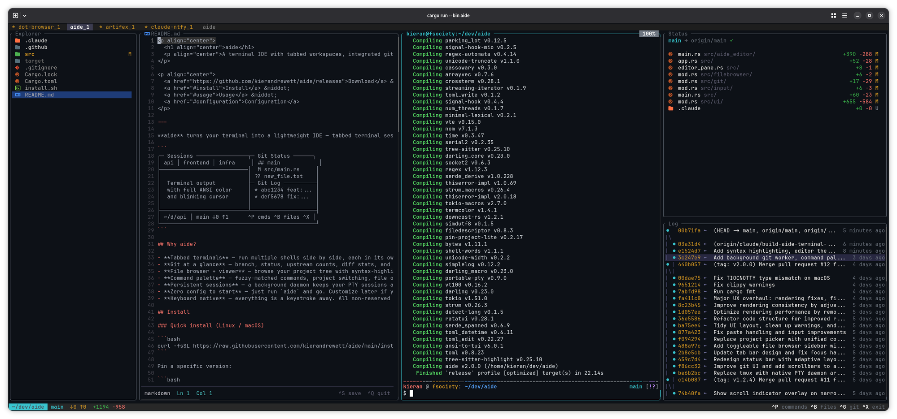

<p align="center">
  <h1 align="center">aide</h1>
  <p align="center">A terminal IDE with tabbed workspaces, integrated git, and a built-in file browser.</p>
</p>

<p align="center">
  <a href="https://github.com/kierandrewett/aide/releases">Download</a> &middot;
  <a href="#install">Install</a> &middot;
  <a href="#usage">Usage</a> &middot;
  <a href="#configuration">Configuration</a>
</p>

<p align="center">
  
</p>

---

**aide** turns your terminal into a lightweight IDE — tabbed terminal sessions, a file browser with syntax-highlighted previews, git context, and a command palette — all keyboard-driven and running in a single process.

```
┌─ Sessions ────────────────┬─ Git Status ──────┐
│ api │ frontend │ infra     │ ## main            │
├───────────────────────────│  M src/main.rs     │
│                           │ ?? new_file.txt    │
│  Terminal output          ├─ Git Log ──────────┤
│  with full ANSI color     │ * abc1234 feat:... │
│  and blinking cursor      │ * def5678 fix:...  │
│                           │                    │
├───────────────────────────┴────────────────────┤
│ ~/d/api │ main ↓0 ↑1      ^P cmds ^B files ^X │
└────────────────────────────────────────────────┘
```

## Why aide?

- **Tabbed terminals** — run multiple shells side by side, each in its own tab with its own working directory
- **Git at a glance** — branch, status, upstream counts, diff stats, and log always visible
- **File browser + viewer** — browse your project tree with syntax-highlighted file previews and sticky line numbers
- **Command palette** — fuzzy-matched commands, project switching, file opening, and git operations via `Ctrl+P`
- **Persistent sessions** — a background daemon keeps your PTY sessions alive across aide restarts
- **Zero config to start** — just run `aide` and go. Customize later if you want
- **Keyboard native** — everything is a keystroke away. All non-reserved keys pass straight through to your shell

## Install

### Quick install (Linux / macOS)

```bash
curl -fsSL https://raw.githubusercontent.com/kierandrewett/aide/main/install.sh | bash
```

Pin a specific version:

```bash
./install.sh v0.1.0
```

Change install location:

```bash
AIDE_INSTALL_DIR=/usr/local/bin curl -fsSL https://raw.githubusercontent.com/kierandrewett/aide/main/install.sh | bash
```

### From GitHub releases

Grab the latest binary from [Releases](https://github.com/kierandrewett/aide/releases):

| Platform              | Archive                      |
|-----------------------|------------------------------|
| Linux (x86_64)        | `aide-x86_64-linux.tar.gz`   |
| Linux (aarch64/ARM)   | `aide-aarch64-linux.tar.gz`  |
| macOS (Intel)         | `aide-x86_64-macos.tar.gz`   |
| macOS (Apple Silicon)  | `aide-aarch64-macos.tar.gz` |

```bash
tar xzf aide-*.tar.gz
mv aide aide-daemon ~/.local/bin/
```

### Build from source

```bash
git clone https://github.com/kierandrewett/aide.git
cd aide
cargo build --release
cp target/release/aide target/release/aide-daemon ~/.local/bin/
```

**Requirements:** git

## Usage

```bash
aide
```

That's it. aide scans your projects directory (`~/dev` by default), and you pick what to work on from the command palette.

### Keybindings

| Key              | Action                            |
|------------------|-----------------------------------|
| `Tab`            | Next tab                          |
| `Shift+Tab`      | Previous tab                     |
| `Ctrl+T`        | New tab                           |
| `Ctrl+P`        | Command palette                   |
| `Ctrl+W`        | Close tab (with confirmation)     |
| `Ctrl+B`        | Toggle file browser               |
| `Ctrl+F`        | Close file viewer                 |
| `Ctrl+G`        | Toggle git panel                  |
| `Ctrl+X`        | Quit aide                         |
| `PgUp` / `PgDn` | Scroll terminal output            |
| `Ctrl+Shift+C`  | Copy selection                    |
| Mouse wheel      | Scroll (vertical)                |
| Shift+scroll     | Scroll (horizontal, file viewer) |

Everything else goes straight to your shell.

### Command palette

`Ctrl+P` opens a fuzzy-matched command palette with:

- **Project switching** — open any folder from your projects directory
- **File opening** — jump to files in the current project
- **Git operations** — push, pull, fetch, stash, commit, and branch switching (run as background jobs with a status bar spinner)
- **Panel toggles** — git panel, file browser

Punctuation is ignored when filtering, so typing "git push" matches "Git: Push".

### File browser

Toggle with `Ctrl+B`. Navigate with arrow keys or mouse clicks. Files open in a syntax-highlighted viewer with:

- Sticky line numbers
- Horizontal scrolling (arrow keys or shift+scroll)
- Text selection and copy (`Ctrl+Shift+C`)

### Responsive layout

Wide terminals (100+ cols) show the full split view: file browser, terminal, and git panels side by side. Narrow terminals collapse to a single-pane layout with panels toggled via keyboard shortcuts.

## Configuration

Config lives at `~/.config/aide/config.toml` and is created automatically on first run:

```toml
command = "$SHELL"
projects_dir = "$HOME/dev"
```

| Key            | What it does                              | Default    |
|----------------|-------------------------------------------|------------|
| `command`      | Command to launch in each terminal tab    | `$SHELL`   |
| `projects_dir` | Directory to scan for project folders     | `$HOME/dev`|

Environment variables (like `$SHELL` and `$HOME`) are resolved at load time, so the config stays portable.

### Custom commands

The `command` field is flexible:

```toml
# Use a specific shell
command = "/bin/zsh"

# Run an AI coding tool
command = "claude"

# Run through a wrapper script
command = "my-wrapper-script"
```

## How it works

aide runs a background daemon (`aide-daemon`) that manages PTY sessions. The daemon spawns pseudo-terminals for each tab and buffers their output. The aide frontend connects over a Unix socket, forwarding your keystrokes and rendering the terminal output via a vt100 parser at ~30fps. Git data refreshes in the background on a 2-3 second cycle.

Because sessions live in the daemon, they persist across:
- aide exits and restarts (auto-reconnects to existing sessions)
- Terminal crashes
- System sleep/wake

### Architecture

```
src/
├── main.rs           Event loop, input batching, refresh timers
├── app.rs            Application state, command palette, background jobs
├── config.rs         TOML config with env var resolution
├── ui/mod.rs         TUI rendering (ratatui)
├── daemon/main.rs    Background PTY daemon (Unix socket IPC)
├── protocol/mod.rs   Client-daemon wire protocol
├── pty_backend/      Daemon client (connect, read, write, resize)
├── sessions/mod.rs   Session lifecycle and tab management
├── git/mod.rs        Git queries (status, log, branch, upstream, diff)
├── filebrowser/      File tree with git status indicators
└── input/mod.rs      Input handling, key batching, passthrough
```

Built with [ratatui](https://github.com/ratatui/ratatui) + [crossterm](https://github.com/crossterm-rs/crossterm) + [portable-pty](https://github.com/wez/wezterm/tree/main/pty) + [vt100](https://github.com/doy/vt100-rust).

## Releasing

Releases are automated via GitHub Actions when a version tag is pushed:

```bash
git tag v0.1.0
git push origin v0.1.0
```

Builds binaries for all 4 platforms (x86_64/aarch64 Linux + macOS), packages them with SHA256 checksums, and publishes a GitHub release.

## License

MIT
